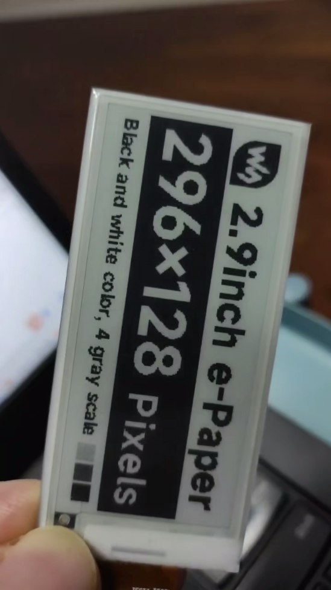

# esp32-idf-epaper-embed

esp32-s3 idf demo for epaper which transfer from waveshare offical demo

## background

I'm using ESP32 S3 board, and waveshare 2.9 inch ink screen(epaper)，ESP-IDF version 5.3.1. The waveshare website support Arduino demo but without esp-idf, so I try to transfer the offical Arduino demo to idf version. It works fine but the screen always flickering when partial refreshing, finally I modified some codes that the demo can run smoothly in esp-idf.

[](https://youtube.com/shorts/8-su44ZCkks)

```
void EPD_2IN9_V2_Display_Partial(UBYTE *Image)
{
	UWORD i;

//Reset
    DEV_Digital_Write(EPD_RST_PIN, 0);
    DEV_Delay_ms(100);						//原来是1，idf下必须加大延迟，否则频闪严重
    DEV_Digital_Write(EPD_RST_PIN, 1);
    DEV_Delay_ms(100);						//原来是2，idf下必须加大延迟，否则频闪严重

```  

