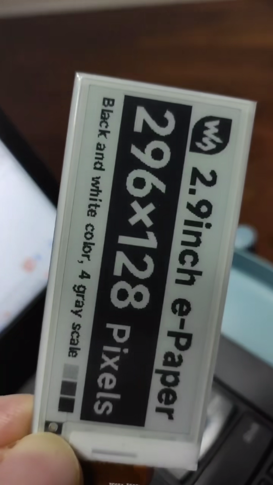

# esp32-idf-epaper-embed

esp32-s3 idf demo for epaper which transfer from waveshare offical demo

## 背景

我用的是ESP32 S3的板子，另外购置了微雪电子的2.9英寸的墨水屏，我的esp-idf版本是5.3.1，想着先跑个demo。但是微雪官方esp的例子只有Arduino的，我用的是ESP-IDF，所以想着把官方的例子（C++）迁移到idf来，试着跑了下，没啥问题，但是局刷的时候屏幕一直狂闪，后来改了如下的代码，可以完美跑完demo了。

[](https://www.bilibili.com/video/BV12Z8CztE6n/?vd_source=c331eb2d16e74e21508aed73d826efa6)

```
void EPD_2IN9_V2_Display_Partial(UBYTE *Image)
{
	UWORD i;

//Reset
    DEV_Digital_Write(EPD_RST_PIN, 0);
    DEV_Delay_ms(100);						//原来是1，idf下必须加大延迟，否则频闪严重
    DEV_Digital_Write(EPD_RST_PIN, 1);
    DEV_Delay_ms(100);						//原来是2，idf下必须加大延迟，否则频闪严重

```  

